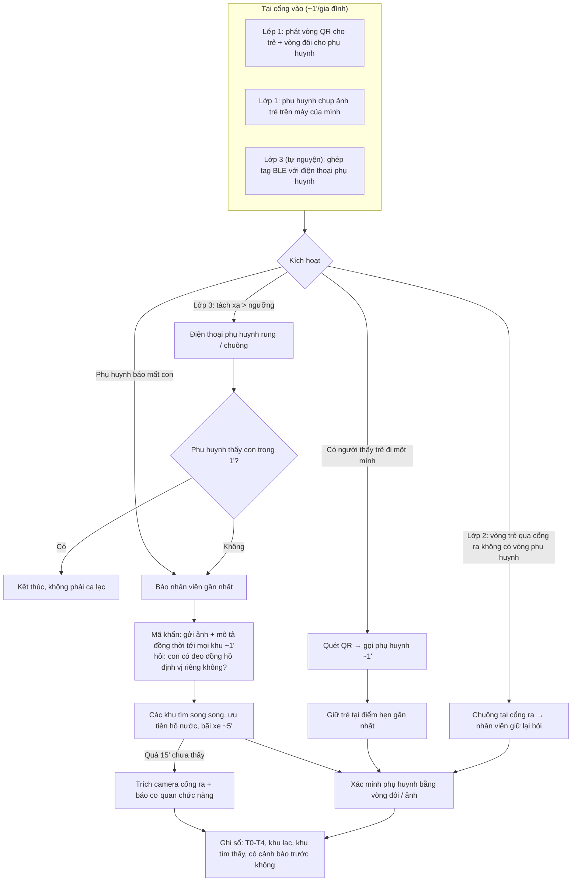

# Phân tích sâu Card #3 — Tìm trẻ lạc: có nên thêm GPS / cảnh báo rung?

> Ý tưởng bổ sung GPS và cơ chế rung / cảnh báo đi lạc do tôi đề xuất. Phần phản biện và so sánh phương án có dùng AI hỗ trợ; các số có dấu `~` là ước tính, các giả định ở mục 9 cần tự kiểm trước khi chốt.

Liên quan: Problem Card #3 trong [individual-report.md](individual-report.md).

---

## 1. Tách lại bài toán: thời gian thật sự mất ở đâu?

Card #3 hiện chỉ đo từ lúc **báo lạc → đoàn tụ** (~25'). Nhưng một ca trẻ lạc có 4 đoạn, và ý tưởng GPS / rung đánh vào những đoạn khác nhau:

```text
T0 Trẻ tách khỏi phụ huynh
 │  (A) phụ huynh chưa biết con đã rời đi            ~1-10', hiện KHÔNG đo được
T1 Phụ huynh phát hiện
 │  (B) tự tìm quanh + tìm tới quầy                   ~8-15'
T2 Báo nhân viên
 │  (C) mô tả bằng lời, truyền bộ đàm tuần tự         ~15'   <-- bottleneck trong card
T3 Tìm thấy trẻ
 │  (D) liên lạc + xác minh phụ huynh                 ~5'
T4 Đoàn tụ
```

| Đoạn | Vì sao chậm | Hướng giải phù hợp |
|---|---|---|
| (A) Tách → phát hiện | Phụ huynh mải chụp ảnh, xếp hàng, trông con khác; đông người nên không để ý | **Cảnh báo tách rời** (rung / chuông trên điện thoại phụ huynh) |
| (B) Phát hiện → báo | Tự tìm trước, không biết quầy ở đâu | Báo bất kỳ nhân viên nào; biển "Báo trẻ lạc" ở mỗi khu |
| (C) Báo → tìm thấy | Mô tả sai lệch, truyền tuần tự | Ảnh + mã khẩn gửi đồng thời; **vị trí gần nhất của trẻ** (GPS / điểm quét) |
| (D) Tìm thấy → đoàn tụ | Trẻ không nhớ số điện thoại | Vòng QR + vòng đôi |
| Rủi ro nặng nhất: trẻ ra khỏi cổng | Cổng ra không kiểm tra trẻ đi với ai | **Kiểm cặp vòng trẻ – phụ huynh tại cổng ra** |

**Nhận xét quan trọng:** đoạn (A) + (B) có thể dài ngang hoặc hơn đoạn (C), nhưng card hiện không đo. Ý tưởng cảnh báo tách rời có giá trị nhất ở chỗ **rút ngắn đoạn (A)**, chứ không phải ở chỗ tìm trẻ nhanh hơn.

---

## 2. So sánh các phương án công nghệ

| # | Phương án | Đánh vào đoạn | Độ tin cậy trong khu vui chơi | Hạ tầng / chi phí | Báo động giả | Rủi ro dữ liệu cá nhân | Cần phụ huynh cài app? |
|---|---|---|---|---|---|---|---|
| A | Vòng QR tĩnh + quy trình mã khẩn (phương án gốc) | B, C, D | Cao — không phụ thuộc sóng, pin | Thấp | Không | Thấp (chỉ số điện thoại) | Không |
| B | Tag Bluetooth (BLE) trên tay trẻ ghép cặp với điện thoại phụ huynh, **rung / chuông khi xa quá ngưỡng** | A | Trung bình — tầm ~10-30 m, giảm mạnh khi đông người | Thấp-trung bình (tag + app) | **Cao** | Trung bình | **Có** |
| C | Đồng hồ / vòng **GPS** có SIM, xem vị trí trẻ trên bản đồ | A, C | Trung bình-thấp — ngoài trời thoáng khá tốt, kém dưới mái che, khu trong nhà, gần công trình cao; khu nước cần chống nước | Cao (thiết bị, SIM, sạc, thu hồi) | Trung bình | **Cao** (theo dõi vị trí liên tục) | Có |
| D | Vòng RFID/NFC + đầu đọc tại cổng từng khu và cổng ra: ghi "điểm quét gần nhất", **chặn trẻ ra cổng không đi cùng vòng phụ huynh** | C, cổng ra | Cao tại điểm đọc, không biết vị trí giữa hai điểm | Trung bình-cao (đầu đọc); thấp nếu khu đã dùng vòng làm vé | Thấp | Trung bình (lịch sử điểm quét) | Không |
| E | Định vị trong nhà bằng UWB (neo cố định) | C | Rất cao | Rất cao | Thấp | Cao | Có / thiết bị riêng |
| F | Nút SOS / rung / đèn / phát âm **trên vòng của trẻ** | C (mét cuối) | Tuỳ công nghệ nền (B hoặc D) | Thấp nếu gắn vào B | Cao nếu trẻ tự bấm | Thấp | Tuỳ |
| G | Camera AI nhận diện khuôn mặt (đã loại ở card) | C | Thấp trong đám đông | Rất cao | Cao | **Rất cao** (sinh trắc học trẻ em) | Không |

Ghi chú kiểm được:
- Độ chính xác GPS trên điện thoại thường khoảng ~5 m khi trời thoáng, kém đi gần nhà cao tầng, dưới mái che, cây cối — xem [gps.gov — GPS Accuracy](https://www.gps.gov/systems/gps/performance/accuracy/).
- Một số công viên lớn đã dùng vòng tay RFID làm vé / thanh toán (VD: MagicBand của Disney) → nếu khu vui chơi đã có vòng vé, phương án D gần như chỉ tốn thêm đầu đọc ở cổng ra.

---

## 3. Góp ý cho ý tưởng GPS + cơ chế rung

### 3.1. GPS
- **Hợp với nhu cầu "biết trẻ đang ở đâu"**, nhưng khu vui chơi có nhiều chỗ GPS kém: nhà trong nhà, thuỷ cung, khu có mái, hàng chờ có mái che, khu nước. Sai số vài mét đến vài chục mét trong đám đông vẫn phải tìm bằng mắt.
- **Chi phí vận hành mới là vấn đề lớn nhất nếu khu vui chơi tự phát thiết bị:** sạc pin mỗi ngày, SIM / dữ liệu, thu hồi ở cổng ra, thất lạc, hư hỏng, vệ sinh.
- **Dữ liệu vị trí liên tục của trẻ em** là dữ liệu cá nhân nhạy cảm → cần phụ huynh đồng ý rõ, quy định ai xem được, lưu bao lâu (tham chiếu Nghị định 13/2023/NĐ-CP về bảo vệ dữ liệu cá nhân — cần kiểm văn bản hiện hành).
- **Hướng thực tế hơn:** không tự phát GPS, mà **hỗ trợ phụ huynh đã có sẵn đồng hồ định vị cho con** — trong quy trình mã khẩn thêm bước "hỏi phụ huynh con có đeo đồng hồ định vị không, mở vị trí cho nhân viên xem".

### 3.2. Cơ chế rung / cảnh báo đi lạc
- **Rung nên đặt ở phía phụ huynh** (điện thoại / vòng của phụ huynh), không phải ở trẻ. Trẻ 3-6 tuổi thấy vòng rung sẽ không hiểu, có thể sợ hoặc tháo ra.
- **Báo động giả là rủi ro lớn nhất.** Trong khu vui chơi, tách nhau là chuyện bình thường: trẻ lên trò chơi còn phụ huynh đứng chờ ở cửa ra, một phụ huynh đi vệ sinh để con với người kia. Cảnh báo kêu liên tục → phụ huynh tắt đi → hệ thống vô dụng.
  - Cần ngưỡng kết hợp **khoảng cách + thời gian** (VD: xa > ~30 m trong > ~60 giây), và chế độ "tạm tắt" khi con đang ở trong khu trò chơi có rào.
- **Rào cản cài app:** cảnh báo Bluetooth chạy nền thường cần app riêng; phụ huynh đang xếp hàng ở cổng rất ngại cài app → tỷ lệ tham gia có thể thấp. Phải đo trong pilot.
- **Phát âm / đèn trên vòng của trẻ do nhân viên kích hoạt từ xa** hữu ích ở "mét cuối" khi đã biết trẻ ở gần, nhưng chỉ nên là tính năng phụ.
- **Nút SOS cho trẻ:** trẻ nhỏ dễ bấm nhầm → nhiều báo động giả; chỉ cân nhắc cho trẻ lớn hơn (~7-10 tuổi).

### 3.3. Thêm GPS / rung có làm bài toán thành "AI" không?
**Không.** GPS, Bluetooth, RFID là cảm biến; cảnh báo theo ngưỡng khoảng cách hay theo vùng (geofence) là **Rule tự động**. Vì vậy phân loại nên cập nhật:

```text
Quick gut cũ:  No AI / process fix
Quick gut mới: No AI — quy trình là nền (lớp 1)
               + Rule tự động — thiết bị cảnh báo theo ngưỡng (lớp 2, lớp 3)
               Không cần LLM / Agent ở bất kỳ bước nào.
```

---

## 4. Đề xuất: triển khai theo 3 lớp

| Lớp | Nội dung | Bắt buộc? | Giải quyết | Vì sao xếp ở lớp này |
|---|---|---|---|---|
| **1. Quy trình nền** | Vòng QR tĩnh + vòng đôi phụ huynh; ảnh chụp tại cổng; mã khẩn gửi đồng thời; điểm hẹn cố định; báo bất kỳ nhân viên nào | Có | (B), (C), (D) | Rẻ, không phụ thuộc pin / sóng / app; vẫn chạy khi mọi thiết bị hỏng |
| **2. Chặn cổng ra** | Đầu đọc RFID/NFC tại cổng ra: vòng trẻ đi qua mà không có vòng phụ huynh cùng mã → chuông báo nhân viên cổng | Nên có (ưu tiên nếu đã dùng vòng làm vé) | Rủi ro nặng nhất: trẻ ra khỏi khu | Chặn đúng hậu quả nghiêm trọng nhất; ít báo động giả vì chỉ kiểm tại một điểm |
| **3. Cảnh báo tách rời (tự nguyện)** | Tag BLE ghép cặp điện thoại phụ huynh, rung khi xa quá ngưỡng khoảng cách + thời gian | Tự nguyện, chạy pilot trước | (A) | Giá trị cao nhưng rủi ro báo động giả và rào cản cài app chưa rõ |
| Không chọn | Tự phát đồng hồ GPS; định vị UWB; camera AI | — | — | Chi phí vận hành / hạ tầng cao hoặc rủi ro dữ liệu quá lớn so với ~15 ca/ngày |

---

## 5. Workflow cập nhật



Human boundary giữ nguyên: **thiết bị chỉ cảnh báo, con người mới xác minh và trao trẻ.** Không giao trẻ chỉ dựa trên tín hiệu thiết bị hay lời nói.

---

## 6. Metric bổ sung

| Metric | Trước | Sau kỳ vọng | Cách đo | Thuộc lớp |
|---|---:|---:|---|---|
| Thời gian báo lạc → đoàn tụ | ~25' | < 10' | Sổ an ninh | 1 |
| Thời gian tách → phụ huynh phát hiện | chưa đo | < 2' với gia đình dùng tag | Log thời điểm cảnh báo của tag + phỏng vấn phụ huynh | 3 |
| Tỷ lệ trẻ dưới ~10 tuổi đeo vòng | 0% | ≥ 90% | Đếm vòng phát tại cổng | 1 |
| Số ca trẻ qua cổng ra không có vòng phụ huynh | chưa đo | 100% bị giữ lại kiểm tra | Log đầu đọc cổng ra | 2 |
| Số cảnh báo giả / gia đình / lượt tham quan | — | ≤ ~1 | Log app + khảo sát khi trả tag | 3 |
| Tỷ lệ phụ huynh chọn dùng tag | — | ≥ ~30% trong pilot | Số tag phát / số gia đình có trẻ nhỏ | 3 |
| Tỷ lệ tag / vòng thất lạc, hư hỏng | — | ≤ ~5% | Kiểm kê cuối ngày | 2, 3 |

---

## 7. Boundary và dữ liệu cá nhân

**Làm:**
- Cảnh báo cho phụ huynh và nhân viên khi có dấu hiệu tách rời / trẻ ra cổng một mình.
- Lưu log sự kiện tối thiểu của ca lạc (thời gian, khu) để cải tiến bố trí.

**Không làm:**
- Không theo dõi vị trí liên tục của trẻ trên hệ thống của khu vui chơi; không lưu lịch sử di chuyển sau khi gia đình rời khu.
- Không in tên trẻ lên vòng; QR chỉ dẫn tới cách liên lạc phụ huynh.
- Không dùng nhận diện khuôn mặt / sinh trắc học.
- Không trao trẻ chỉ dựa trên tín hiệu thiết bị.

**Dữ liệu:**
- Phụ huynh đồng ý rõ ràng khi nhận vòng / tag; lớp 3 hoàn toàn tự nguyện.
- Dữ liệu ghép cặp xoá khi trả vòng / cuối ngày; ảnh chụp trẻ nằm trên máy phụ huynh, chỉ gửi vào nhóm nội bộ khi có ca lạc và xoá sau khi đóng ca.

---

## 8. Pilot nhỏ nhất và điều kiện dừng

**Pilot:**
- Lớp 1: áp dụng toàn khu ngay, chi phí thấp.
- Lớp 2: 1 cổng ra chính, 2 cuối tuần.
- Lớp 3: ~50-100 tag BLE tại khu trò chơi trẻ em, 2 cuối tuần, phụ huynh tự nguyện.

**Đo:** thời gian T0-T4 của mọi ca lạc; số cảnh báo giả; tỷ lệ tham gia; số tag thất lạc; phản hồi phụ huynh khi trả tag.

**Dừng / hạ cấp:**
- Lớp 3: cảnh báo giả > ~1 lần / gia đình / lượt, hoặc tỷ lệ tham gia < ~20% → dừng tag, giữ lớp 1 + 2.
- Lớp 2: chuông cổng ra kêu nhầm gây ùn cổng giờ tan → chỉ bật giờ thấp điểm hoặc chuyển sang kiểm tra ngẫu nhiên.
- Mọi lớp công nghệ lỗi → lớp 1 vẫn chạy độc lập.

---

## 9. Giả định cần validate trước khi chốt

| Giả định | Cách kiểm nhanh |
|---|---|
| ~15 ca/ngày cao điểm, ~25'/ca | Hỏi nhân viên an ninh / quầy thông tin một khu vui chơi, xin xem sổ ghi nhận |
| Đoạn (A) tách → phát hiện thường dài vài phút | Phỏng vấn 3-5 phụ huynh từng bị lạc con: "Con rời đi bao lâu thì anh/chị mới để ý?" |
| Phần lớn ca lạc xảy ra ở khu ngoài trời hay trong nhà | Hỏi nhân viên; quyết định GPS có đáng xem xét không |
| Khu vui chơi đã dùng vòng tay làm vé chưa | Hỏi / quan sát tại cổng → quyết định chi phí lớp 2 |
| Phụ huynh sẵn sàng cài app để nhận cảnh báo | Mini survey 10 phụ huynh có con dưới 10 tuổi |
| Ngưỡng khoảng cách + thời gian nào cân bằng giữa bỏ sót và báo động giả | Thử nghiệm với 3-5 gia đình trong 1 buổi trước pilot |
